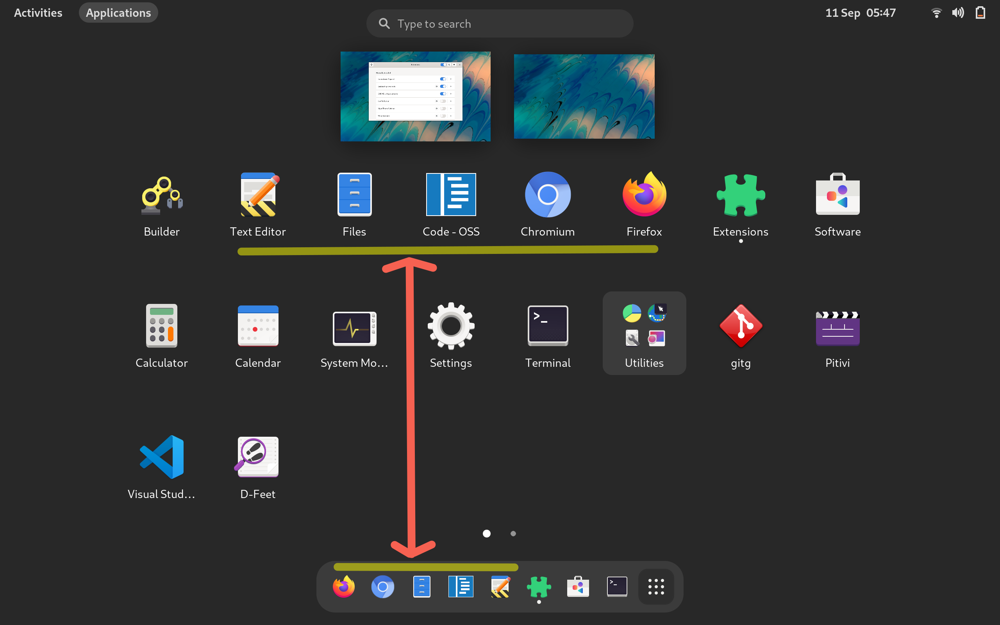

### Description
Starting with GNOME 40, favourite applications are only displayed in dock.
This extension makes them appear in application grid as well.
### Installation
<a href="https://extensions.gnome.org/extension/4485/favourites-in-appgrid/">

</a>

#### From git repo
```
make
```

### Screenshot
